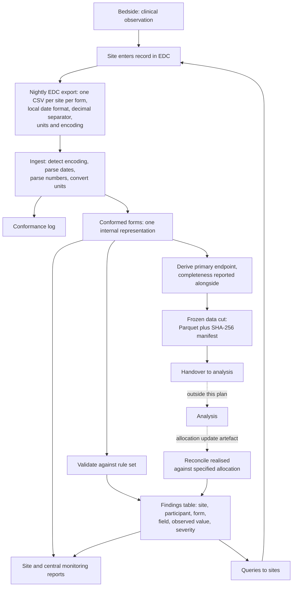

# Data management plan

| | |
|---|---|
| **Trial** | INCEPT-style adaptive platform trial (synthetic reference implementation) |
| **Domains** | FLUID, ANTICOAG, OXYGEN, running concurrently over a shared population |
| **DMP version** | 1.0 |
| **Effective date** | 28 August 2026 |
| **Supersedes** | none |
| **Owner** | Data management function, coordinating centre |

> **This plan describes a synthetic trial.** No participant in it is real and no dataset
> here contains personal data. It is written the way a trial unit would write one because
> the point of the exercise is the discipline, not the data.

## How to read the status markers

Every section below carries one of two markers. The distinction is the whole purpose of
this document, so it is stated once here and then not apologised for again.

- **Implemented.** The pipeline in this repository does what the section describes, and
  the section links to the code and the tests that prove it.
- **Specified, not implemented.** The section states what the trial requires and how it
  should work. No code here does it. It is named so that whoever picks this up knows it is
  a known gap with a stated design, not an oversight.

A plan that only described the built parts would be a README. A plan that described
everything without saying which parts exist would be a wish list.

---

## 1. Scope and version control

This plan governs the capture, validation, cleaning, freezing and retention of clinical
data for all domains of the platform, from the point a site enters a value into the EDC to
the point a frozen dataset is handed to an analysis.

It does **not** govern the analysis itself. Allocation probabilities, interim decisions and
statistical methods are outside this plan and outside this repository. The boundary is the
frozen data cut: producing it, proving it reproducible and handing it over is data
management; what is done with it afterwards is not. See section 9.

**Versioning.** This document is versioned independently of the code. The rule set is
versioned separately again, by content hash, so a finding raised under an older rule set
remains interpretable after the rules change. Every change to this plan is recorded in the
change log at the bottom, with a date and a reason.

**Status: implemented** for the scope boundary and the rule set versioning.
`rule_set_version()` in [R/validate/engine.R](../R/validate/engine.R) hashes the rule files
and stamps every finding with the result.

---

## 2. Roles and responsibilities

Who may do what to data. The principle throughout is that the person who can create a
problem is not the person who signs off that it is resolved.

| Role | May | May not |
|---|---|---|
| **Site investigator** | Enter and correct data for their own site. Answer queries. Confirm a query is resolved. | See other sites' data. Close a `critical` finding unilaterally. Alter a value inside a frozen cut without it being detected. |
| **Site data entry staff** | Enter and correct data for their own site. Answer queries. | Close any query. Access data from other sites. |
| **Data manager (coordinating centre)** | Run the pipeline, raise and route queries, close queries, produce cuts, amend the rule set and this plan. | Enter or alter site data directly. Approve their own rule change without review. |
| **Trial registrar** | Manage participant identifiers and randomisation records. Investigate identity findings. | Alter clinical values. |
| **Central monitor** | Read all site metrics and central monitoring output. Trigger a site visit or escalation. | Alter data or close data queries. |
| **Statistician** | Receive a frozen cut and its manifest. Verify the manifest. | Access the live database. Request a cut regenerated with different content under the same cut ID. |
| **Sponsor / steering committee** | Receive aggregate reports and frozen cuts. Approve database lock. | Access unblinded interim data outside the pre-specified process. |

**Access is by site and by role.** A site sees its own data. The coordinating centre sees
all of it. The separation matters most for the `critical` severities: a finding that a
participant identifier is duplicated across two sites cannot be resolved by either site
alone, because neither can see the other half of the problem.

**Notification routing.** Each finding carries a `severity` and an `action`. `escalate`
means the coordinating centre is notified alongside the site; `query` means the site alone.
Routing to named individuals per site and per role, as `config/roles.yml`, is not built.

**Status: specified, not implemented** for role-based access enforcement and notification
routing. The severity and action fields that routing would consume are implemented and
carried on every finding.

---

## 3. Data flow

The dotted edges are the boundary. An analysis consumes a cut and may issue an allocation
update; this plan covers the integrity of what crosses the boundary in each direction, and
nothing about what happens on the far side.

**Status: implemented** except the dotted section. The allocation update artefact and the
reconciliation that checks it are implemented
([R/allocate/allocation_update.R](../R/allocate/allocation_update.R)); the analysis that
would produce the probabilities is not, and by design is not.

---

## 4. Data sources

| Source | Form | Grain | Notes |
|---|---|---|---|
| EDC | `screening` | One row per screened patient | Includes patients not enrolled |
| EDC | `randomisation` | One row per participant per domain | A participant may be randomised in more than one domain |
| EDC | `daily_icu` | One row per participant per ICU day | The densest form and the source of the primary endpoint |
| EDC | `outcome_30d` | One row per participant per domain | Vital status and discharge dates |
| EDC | `adverse_events` | One row per event | Serious events are a subset, flagged |

**The export is the boundary, and it is deliberately messy.** Sites export in their own
locale: five countries, two date formats across them, two decimal separators, and at least
one site exporting latin1 rather than UTF-8. Encoding is detected from the bytes, not read
from configuration, because a site that changes its export settings will not tell you.

**External sources.** A real trial of this design would reconcile against at least a
national patient registry for vital status and a pharmacovigilance database for serious
adverse events. Neither is simulated here. SAE reconciliation is the more important of the
two.

**Status: implemented** for the five EDC forms and the multi-locale ingest.
**Specified, not implemented** for external source reconciliation.

---

## 5. Data dictionary

Every field, its type, its bounds, whether it is required, and what it means:
**[docs/data_dictionary.md](data_dictionary.md)**.

That document is generated from `config/schema/*.yml` by `scripts/generate_docs.R`. It is
generated rather than written so that it cannot drift from the schemas the pipeline
actually enforces. If a field's bounds change, the dictionary changes with it.

**Status: implemented.**

---

## 6. Validation approach

The full standard operating procedure is **[docs/validation_plan.md](validation_plan.md)**,
also generated from configuration. In summary:

**The engine is generic and the rules are data.** No R code knows what a vasopressor is.
Every check lives in `config/rules/*.yml` as an expression, a severity, a description and a
rationale, so a clinician can read the entire rule set and propose a change without reading
any R.

**Severity describes consequence for the trial, not difficulty of fixing.**

| Severity | Meaning | Response |
|---|---|---|
| `critical` | The analysis population, the primary outcome or a participant's identity is affected | Escalated to the coordinating centre the same working day. Not closed by the site alone. |
| `major` | A required value is absent or implausible. The record is usable but suspect. | Query raised with the site. Expected turnaround 14 days. |
| `minor` | A supporting value is missing but no analysis depends on it | Query raised, batched with the site's next routine contact |
| `informational` | Recorded for monitoring; no site action expected | Central monitoring report only |

**The rule set is scored, not trusted.** A catalogue of defects is injected into the clean
synthetic data with ground truth recorded, so the engine's recall is measured per defect
type, including what it misses. The current figure is 99.3% of defect records that a rule
targets, and the README states plainly which defect types no rule targets at all rather
than scoring them as zero.

**Changing a rule.** A rule change is a change to configuration, reviewed like a code
change, and it moves the rule set hash. Findings raised under the previous hash are not
retrospectively reinterpreted.

**Status: implemented.** 23 rules across five categories, with recall measured against 13
injected defect types.

---

## 7. Query management

**Status: specified, not implemented.** This is the largest gap in the pipeline and the
most likely first task for whoever takes it on. `R/validate/` produces findings; nothing
turns them into managed queries.

A finding is an observation. A query is an obligation with a clock on it. The design:

**Lifecycle.** `raised` to `sent_to_site` to `answered` to `closed`, plus `reopened` when
the answer does not resolve the finding. A query reopened twice is itself a signal about
the site, not about the record.

**Identity and deduplication.** A query is keyed on the finding's rule, participant, form
and field, so that the same underlying problem reappearing in a later export attaches to
the existing query rather than raising a second one. A site sent the same query twice stops
reading queries.

**Ageing is the signal, not count.** Days open, banded 0 to 7, 8 to 30, 31 to 90, and over
90. Twenty open queries is normal for an active site. Twenty open queries averaging 90 days
means nobody at that site is reading them. Reports must lead with the ageing distribution
and not the count.

**Escalation thresholds.** A `critical` query open beyond 7 days, or any query beyond 90,
escalates to the central monitor regardless of severity. Escalation is a pipeline
behaviour, not a reminder somebody is supposed to act on. See section 10 on why that
distinction is load bearing.

**Closure.** A query closes when the finding no longer fires against a subsequent export,
not when a site asserts it is fixed. `critical` queries additionally require coordinating
centre sign off, per section 2.

**Simulating it.** To be worth anything the simulation must give sites differing
responsiveness, so that ageing distributions actually separate and the report has something
to detect. Per-site responsiveness belongs in `config/trial.yml` alongside the existing
timeliness parameters.

Intended home: `R/query/`.

---

## 8. Data cleaning cycles

**Routine cleaning** runs on every export. The pipeline ingests, validates, and produces
site reports that lead with the three things that site should do next. This is continuous
and needs no decision from anyone.

**Pre-analysis cleaning** runs before a cut is taken and is a different activity. It is a
deliberate sweep with a defined stopping point, covering:

1. All open `critical` and `major` queries on participants who will be inside the cut
2. Cross-domain consistency for participants randomised in more than one domain
3. Completeness of the primary endpoint, participant by participant, with the unknown and
   conflicting day counts inspected rather than summed away
4. Allocation reconciliation for the period since the last cut

**"Clean for analysis" is a defined state, not a judgement.** A cut may be taken when no
`critical` finding is open against any participant inside it, every `major` finding is
either resolved or documented as unresolvable, and the primary endpoint completeness is
reported alongside the cut rather than assumed. A cut taken with known open findings is
permitted; a cut taken without stating them is not.

**Endpoint completeness is reported, never imputed silently.** The endpoint derivation
returns `unknown_days`, `conflicting_days` and a `complete` flag beside the value itself,
because a days-alive count derived from absent data and one derived from present data are
different numbers that should not look identical downstream.

**Status: implemented** for routine cleaning, endpoint completeness reporting and
allocation reconciliation. **Specified, not implemented** for the query-driven parts of the
pre-analysis sweep, which depend on section 7.

---

## 9. Database lock and data cuts

Full procedure: **[docs/data_cut_sop.md](data_cut_sop.md)**.

A cut is all participants who completed 30-day follow-up as of date D, frozen, while
enrolment continues past them. `make_cut(as_of_date)` produces the frozen Parquet, a
manifest carrying the cut ID, as-of date, creation timestamp, participant counts by site
and domain, row counts by form, a SHA-256 of every file, package versions, the git commit
SHA and the rule set version, and a human-readable summary.

**The reproducibility claim is tested, not asserted.** A test regenerates a historical cut
from the same inputs and asserts hash equality. The question "can you regenerate the exact
dataset a committee saw a year ago" has an answer here, and the answer is a passing test.

**`verify_cut()` refuses to return data from an altered cut.** Not a warning. The integrity
check is a precondition of reading, so it cannot be skipped by somebody in a hurry.

**Post-lock changes.** A site editing a value that sits inside an already-frozen cut is a
serious finding in a regulated trial, and the manifests already carry the per-file hashes
that make it detectable. Detecting it, flagging it `critical` and surfacing it in the
central report is **specified, not implemented**.

**Status: implemented** for cuts, manifests, verification and the reproducibility proof.
**Specified, not implemented** for post-lock change detection.

---

## 10. Data protection

**Status: specified, not implemented**, other than the design principle below, which is
already demonstrated elsewhere in the pipeline.

The trial runs across five countries. Nothing in this repository contains personal data,
but a real deployment would, and the plan has to state how it would be handled.

**Data minimisation at the export boundary.** Sites export what the schemas define and
nothing else. Direct identifiers never leave the site: the pipeline works on a participant
identifier issued by the trial registrar, and the mapping back to a patient stays in the
site's own system.

**Cross-border transfer.** Participant-level data moving between countries requires a
recorded lawful basis for that country pair. The intended mechanism is
`config/countries.yml` carrying the permitted transfers, and a **transfer guard** in the
pipeline that refuses to assemble a cross-border dataset for which no basis is recorded.

**The guard is the point.** The reason to build it as pipeline behaviour rather than as a
line in a policy document is the same reason `verify_cut()` refuses rather than warns: an
obligation somebody is supposed to remember is not a control. This project has already
learned that lesson once, at some cost, and it is recorded in
[docs/decisions.md](decisions.md).

**Onward transfer.** A frozen cut leaving the coordinating centre carries its manifest. The
recipient can verify what they received; the sender can prove what they sent.

---

## 11. Retention and archiving

**Status: specified, not implemented.**

**Retention.** Trial data is retained for the period required by the applicable regulation
in each participating country, and where those differ, the longest applies. Retention runs
from database lock, not from the end of enrolment.

**What is archived.** Not just the final dataset. An archive that cannot reconstruct how
the dataset came to exist is not an archive. The set is: every frozen cut with its
manifest, the rule set at each cut's hash, this plan at each version, the decision log, the
generated data dictionary and validation plan, and the pipeline source at the git commit
each manifest names.

**Because the manifests record the commit SHA, the package versions and the rule set hash,
the archive is self-describing.** Any cut in it can be traced to the exact code and
configuration that produced it. This is the single strongest argument for the manifest
design and the reason its content list in section 9 is as long as it is.

**Backup.** Three copies, two media, one off site, verified by restore rather than by the
backup job reporting success. A backup nobody has restored is a hypothesis.

Intended home: `R/archive/`.

---

## 12. Training and site onboarding

**Status: specified, not implemented.**

A site cannot randomise until onboarding is complete. Onboarding covers:

1. Delegation log: who at the site holds which role from section 2
2. EDC access provisioned per role, and a confirmed test entry in the training environment
3. Confirmation of the site's export locale: date format, decimal separator, units and
   encoding, recorded in `config/trial.yml` and verified against a real export before the
   first participant, not after
4. Walkthrough of the query process and the expected turnaround by severity
5. Named contact for queries, with a deputy

**Point 3 is not administrative.** Most of the ingest work in this pipeline exists because
sites export in their own locale and do not announce when it changes. Verifying the locale
against an actual export at onboarding catches at the cheapest possible moment what
otherwise surfaces as an unparseable date six months in.

**Re-onboarding.** A change of site staff in a delegated role, or a change in the site's
export configuration, requires the affected steps again.

Intended home: `docs/site_onboarding.md` and `R/onboarding/`.

---

## 13. Metrics

The data management function reports on itself. These are the KPIs, reviewed monthly.

| Metric | Definition | Status |
|---|---|---|
| Entry timeliness | Median days from event to EDC entry, by site by month, against the site's own baseline | Implemented |
| Completeness | Proportion of required fields present, by site by form by month | Implemented |
| Finding rate | Findings per 100 records, by site, by severity | Implemented |
| Validation recall | Proportion of injected defects the rule set detects, by defect type | Implemented |
| Endpoint completeness | Proportion of participants whose primary endpoint rests on no absent data | Implemented |
| Allocation conformance | Sites whose realised allocation departs from the specified ratio | Implemented |
| Query ageing | Distribution of days open, banded, by site | Not implemented (section 7) |
| Query closure rate | Queries closed within the turnaround for their severity | Not implemented (section 7) |
| Post-lock edits | Edits to values inside a frozen cut, per cut | Not implemented (section 9) |

**Trends, not thresholds, for the timeliness metrics.** A site whose median entry delay is
9 days has a working process running slowly. A site whose delay was 3 days and is now 9 has
something wrong that started recently, and that is the more urgent problem even though one
of those numbers is not worse than the other. The monitoring layer compares each site to
its own history and to the concurrent all-site median, so that a trial-wide slowdown at
Christmas is not reported as twenty-five site failures.

**Site reports lead with actions.** A report that lists 400 findings has told a coordinator
nothing. Each site report opens with the three things that site should do next.

---

## Open scope, in priority order

For whoever takes this on. Ordered by what unblocks the most.

1. **Query management** (section 7). Findings exist and go nowhere. Everything about
   cleaning cycles, escalation and two of the nine KPIs depends on it.
2. **Post-lock change detection** (section 9). Small, self-contained, and the cut manifests
   already carry what it needs.
3. **Risk-based central monitoring**. Terminal-digit preference, site variance far below
   pooled, and adverse event under-reporting as a funnel plot with control limits. Three
   injected defect types (D09, D10, D12) currently have no detector, which the README
   states openly rather than hiding.
4. **SAE reconciliation** against an external pharmacovigilance source (section 4).
5. **Cross-border transfer guard** (section 10).
6. **Roles, retention and onboarding** (sections 2, 11, 12).

Items 1 to 3 are pipeline work. Items 4 to 6 are governance work with small code
components. They are independent of each other and can be taken in any order.

---

## Change log

| Version | Date | Change | Reason |
|---|---|---|---|
| 1.0 | 28 August 2026 | Initial version | First statement of the plan, written at the point the pipeline was handed over. Records the scope boundary at the frozen cut, and marks each section implemented or specified so that the built and unbuilt parts are distinguishable. |
